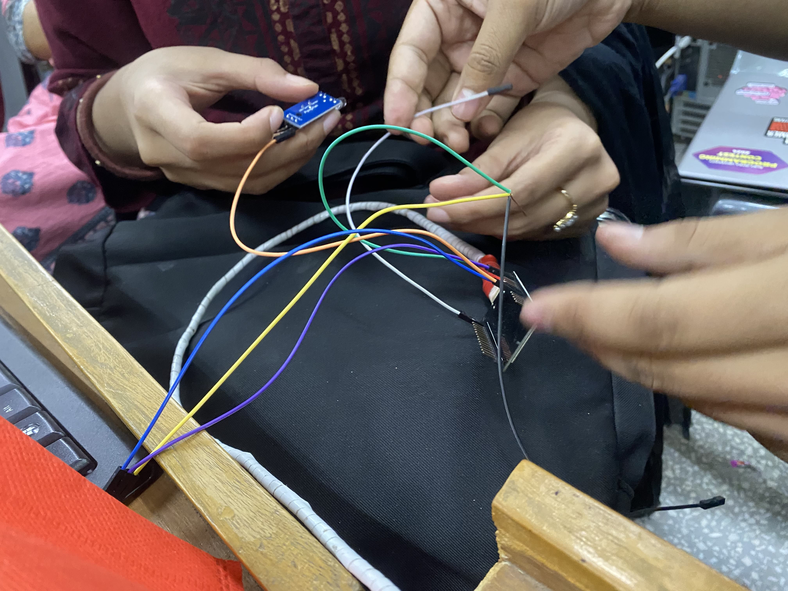
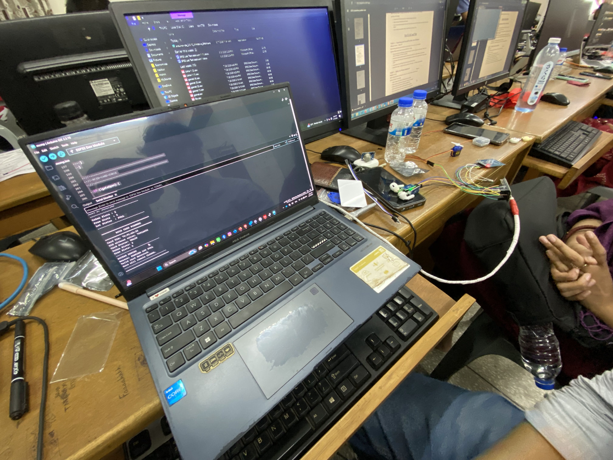
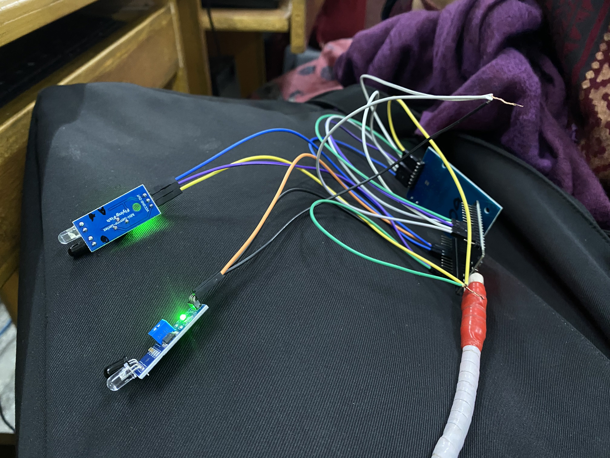
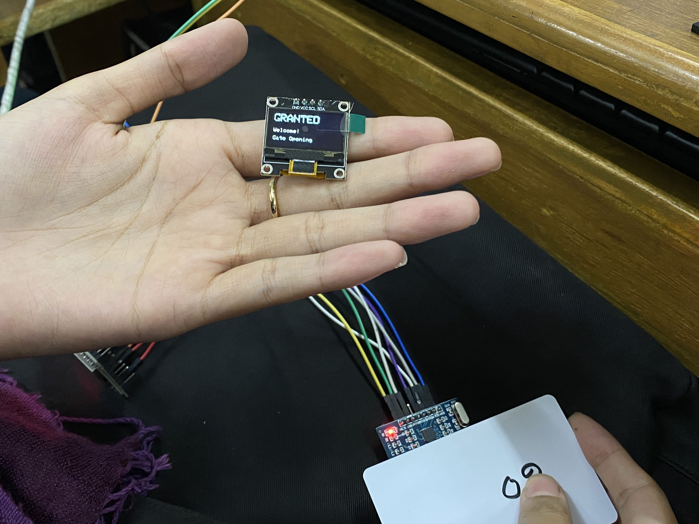
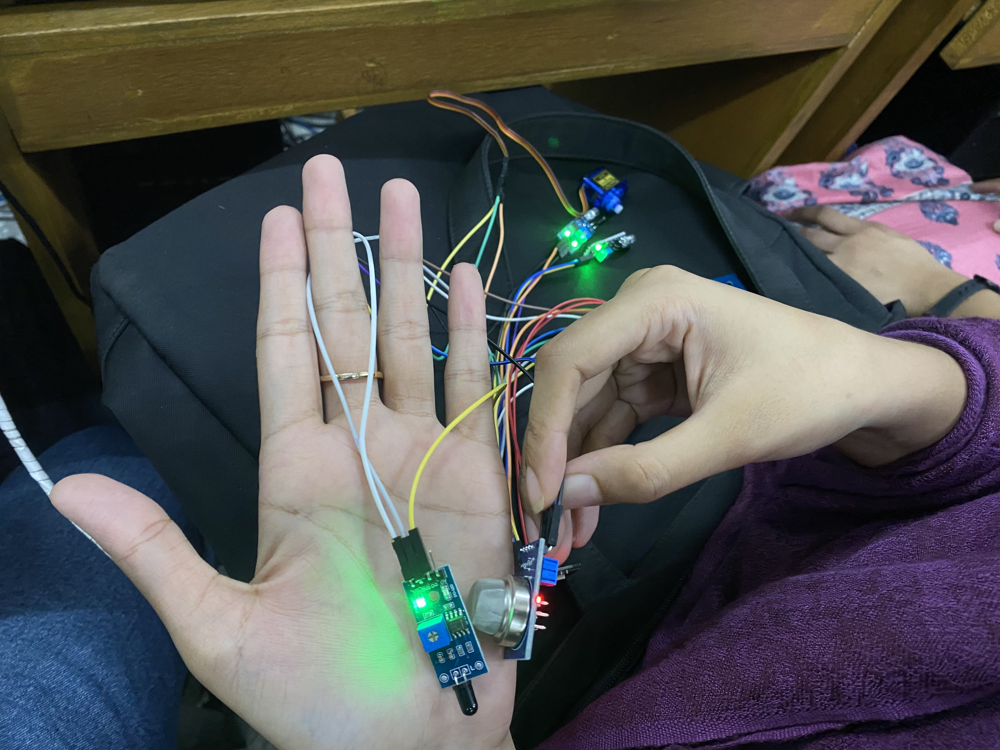
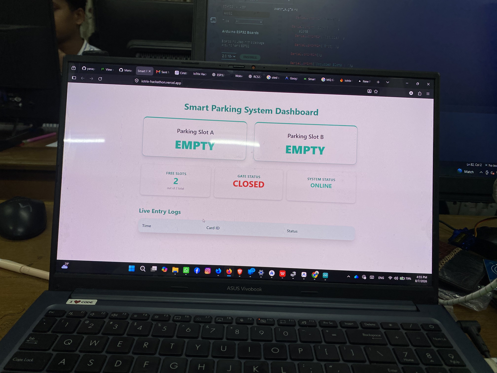

# Smart Parking System - IoTriX Hackathon

## 🏆 Achievement: 1st Runner Up
We are proud to announce that our team, **Next Gen Innovators**, secured the **1st Runner Up** position in the **IoTriX Hackathon**!

---

## 👥 Team: Next Gen Innovators
**Department:** Computer Science and Engineering (CSE), BUBT
**Organized By:** IEEE BUBT Student Branch  
**University:** BANGLADESH UNIVERSITY OF BUSINESS AND TECHNOLOGY (BUBT)

| Name | ID | Role |
| :--- | :--- | :--- |
| [**Yacin Arafat**](https://github.com/yanayem) | 20245103160 | Leader & Software |
| [**Dipta Dey**](https://github.com/Dipto-04) | 20245103143 | Hardware Assembly & Video Content Lead |
| [**Sayma Rahman Eva**](https://github.com/evasayma) | 20245103060 | Documentation |
| [**Taspiya Jannat Prottasha**](https://github.com/Jannat651) | 20245103057 | Documentation & Presentation |
| [**Nabiha Naz**](https://github.com/nabiha26) | 20245103061 | Hardware Engineer |
| [**Nafisa Akter**](https://github.com/nafisabindu) | 20245103042 | Circuit Design |
| [**Mijanur Rahman**](https://github.com/Mijanur-Rahman0) | 20245103053 | Software |

---

## 🔗 Project Links
- **Live Web App:** [https://iotrix-hackathon.vercel.app/](https://iotrix-hackathon.vercel.app/)
- **Project Presentation (Slide):** [Canva Link](https://www.canva.com/design/DAHRmhz0IVc/W53ZB-pR_pm0v3IXTGx-jQ/edit)
- **Project Development Journey (Video):** [Google Drive Link](https://drive.google.com/drive/folders/1gjPSIcO_C57IRj_9_ykD4r7I6sPcKRLW)
- **Detailed Project Report:** [OneDrive Link](https://onedrive.live.com/:w:/g/personal/d9b964f88f5b5a7d/IQDNyAkKpUWzRZBbPr4i5HnjAeHuG0xLBmq0QfCfam8Ay3A?rtime=CwWITiH23kg&redeem=aHR0cHM6Ly8xZHJ2Lm1zL3cvYy9kOWI5NjRmODhmNWI1YTdkL0lRRE55QWtLcFVXelJaQmJQcjRpNUhuakFlSHVHMHhMQm1xMFFmQ2ZhbThBeTNB)
- **Official Challenge Task Sheet:** [PDF Link](assets/IoTrix_hackathon_problemsets.pdf)

---

## 🛠️ Project Tasks & Implementation

### Part I: Hardware

#### Task 1: Parking Slot Occupancy Detection
Using 2× IR sensors to detect if Slot A or Slot B is full.

#### Task 2: RFID-Controlled Entry Gate
Servo-motor-based gate that opens only for valid RFID cards, provided there is space available.

#### Task 3: Entrance OLED Display
Live status and welcome messages shown on a 0.96″ OLED screen for drivers.

### Part II: IoT & Web

#### Task 4: Firebase Integration (Gas & Fire Safety)
Real-time monitoring of MQ Gas and Fire sensors with automatic cloud alerts.

#### Task 5: Live Web Dashboard
Responsive UI showing real-time slot status, history logs, and emergency banners.

#### Task 6: Smart IoT Security (FreeRTOS)
Multi-core execution on ESP32 using FreeRTOS for simultaneous sensor monitoring and web communication.

#### Task 7: Advanced Dashboard Features
Search/filter history, parking fee calculation, and Dark/Light mode toggle.

### Part III: AI (Bonus)

#### Task 8: AI Vehicle Counting & Slot Detection
Real-time AI object detection (TensorFlow.js) using a phone camera to cross-verify physical sensor data.

#### Task 9: Documentation & Presentation
Detailed system architecture and a 7-minute project demonstration video.

---

## 📦 Hardware Kit
- ESP32-WROOM-32
- 2× IR Sensors
- MQ Gas Sensor
- Fire Sensor
- SG90 Servo Motor
- RFID-RC522 Reader + Cards
- 0.96″ OLED Screen

---
*Developed for IoTriX Hackathon | Organized by IEEE BUBT Student Branch*
